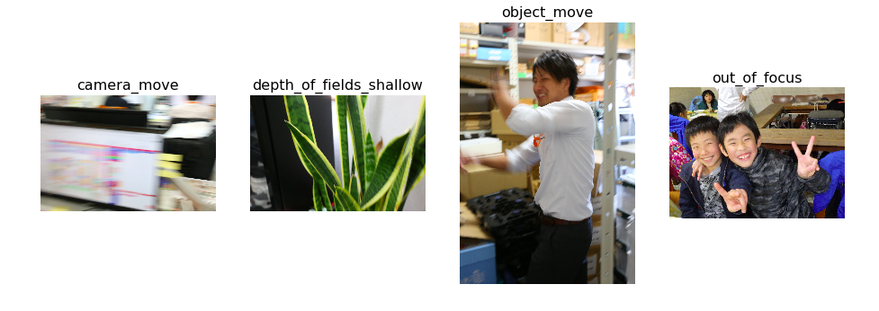

# Description
There were lots of photos with excessive amounts of blurring, which are taken from users. This project will classify good/bad images by using deep learning.

## Table of Contents

* [Dataset description](#dataset-description)
  * [File and columns description](#file-and-columns-description)
  * [Folder structure](#folder-structure)
* [Evaluation](#dvaluation)
* [Submission format](#dubmission-format)

## Dataset description

### File and columns description
* Some [researches](http://www.digital-photo-secrets.com/tip/129/the-top-4-causes-of-blurry-photos-and-how-to-fix-them/) indicate that the top four main cause of blurry photos are:
    - Out Of Focus [[img]](https://gitlab.com/marknguyen/blurry_classification/blob/master/assets/out_of_focus.JPG)
    - The subject moves while the shutter is open [[img]](https://gitlab.com/marknguyen/blurry_classification/blob/master/assets/object_move.JPG)
    - The camera moves while the shutter is open [[img]](https://gitlab.com/marknguyen/blurry_classification/blob/master/assets/camera_move.JPG)
    - Depth Of Field is too shallow [[img]](https://gitlab.com/marknguyen/blurry_classification/blob/master/assets/depth_of_field_shallow.JPG)

* We define train & test datasets followed by four metrics above (1692 OK and 13798 NG images): 
    - OK: clear focused-objects, not blurry, good contract
    - NG:  blurry (out_of_focus, object_move, camera_move, depth_of_field)

Dataset Link: https://goo.gl/yp1XS6

### Folder structure
    Dataset
            |__train
            |    |__OK (1692)
            |    |__NG (13798)
            |       |__camera_move
            |       |__depth_of_field_shallow
            |       |__object_move
            |       |__out_of_focus
            |
            |__test
                |__OK (49)
                |__NG (49)
                    |__camera_move
                    |__depth_of_field_shallow
                    |__object_move
                    |__out_of_focus
## Evaluation
### Metrics
    * binary_crossentropy
       

## Submission format
### Output
* {'OK': 0, 'NG': 1}
* Check the result-logs in the [result_logs.md](https://gitlab.com/marknguyen/blurry_classification/blob/master/result_logs.md).

## Changes log

2018/05/20 10:00: Added more type of images into train dataset.

2018/05/15 14:00: Removed motion and out-of-focus images from NG dataset. (because this type of images does not macth with our dataset standard)

2018/05/15 10:00: Init document

