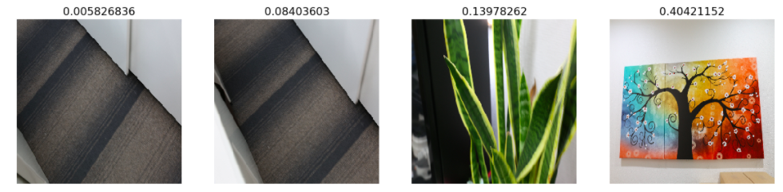

# Log_loss  
       
## Ver2: Add more "out_of_focus, object_move, camera_move, depth_of_field" images and keep OK images from unsplash website.
        
Dataset includes 1692 OK and 13798 NG images

        Train model with 105 epochs. Size: (256x256x3)
        Confusion matrix on test data:
           | TN: 46         |  FP: 3
           | FN: 4          |  TP: 45       
        Acc: 0.9285714261385859
        F1 score: 0.9278350515463918
        Recall: 0.9183673469387755
        Cross_entropy: 0.004020534652505373 (train), 0.018242579215918032 (val), 0.12033782686505999 (test)

Wrong predicted images: 
        

------------------------------------------------------------------------
## Ver1: Dataset with almost NG "camera_move" images and OK images from unsplash website.
        
Dataset includes 1692 OK and 706 NG images)
        
        Train model with 50 epochs. Size: (512x512x3)
        Confusion matrix on test data:
           | TN: 49         |  FP: 0
           | FN: 14         |  TP: 34       
        Acc: 0.8556701024783027
        F1 score: 0.8292682926829268
        Cross_entropy: 3.9289337897756345 (test)

